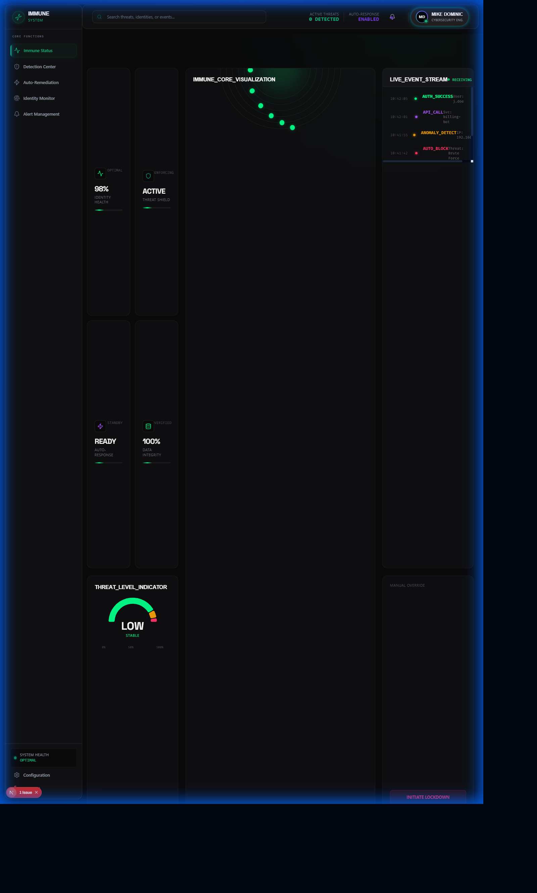
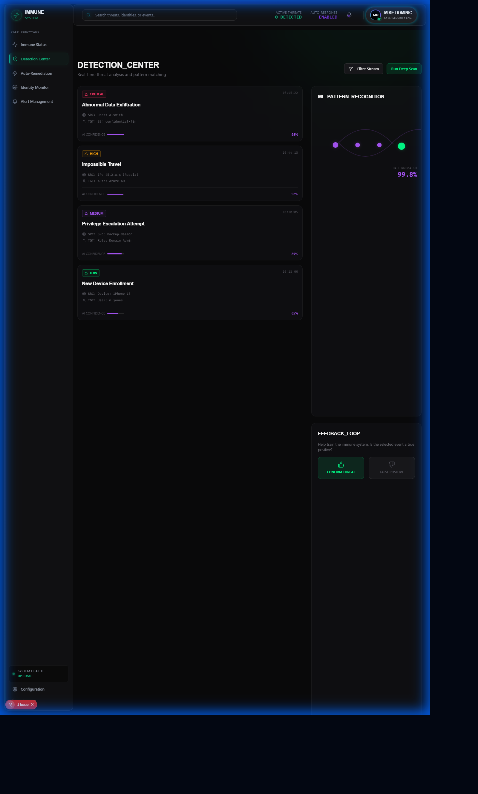
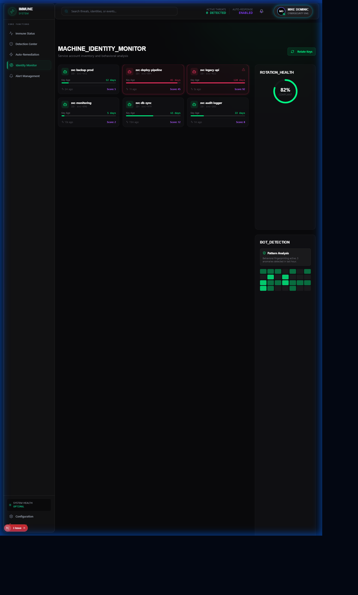

<p align="center">
  
</p>

<h1 align="center">IAM Immune System</h1>
<h3 align="center">Event-Driven Security Automation with SailPoint IGA Integration</h3>

<p align="center">
  
  
  
  
  
</p>

<p align="center">
  <strong>Real-time threat detection and auto-remediation for cloud IAM with ML anomaly detection and SailPoint lifecycle integration</strong>
</p>

---

## The Problem

<table>
<tr>
<td width="50%">

### Cloud IAM Changes Happen Faster Than Security Can React

Enterprise challenges with cloud IAM:
- **100s of IAM changes** daily across projects
- **Misconfiguration** is #1 cloud security risk
- **Public bucket** exposure happens in seconds
- **Admin grants** can go unnoticed for weeks

Manual IAM review cannot:
- Detect threats in real-time
- Correlate with identity lifecycle
- Auto-remediate before damage
- Scale with cloud growth

</td>
<td width="50%">

### What Organizations Need

Modern cloud security requires:
- **Real-time event processing** for IAM changes
- **ML anomaly detection** at scale
- **Automated remediation** (block, revoke, alert)
- **IGA integration** for identity context
- **Low-cost serverless** architecture
- **Multi-cloud visibility**

**Think of it as an immune system for your cloud.**

</td>
</tr>
</table>

---

## The Solution: IAM Immune System

<p align="center">
  
</p>

Event-driven security automation powered by ML and IGA:

| Capability | Technology | Outcome |
|------------|------------|---------|
| **Event Processing** | GCP Eventarc + Cloud Functions | Real-time IAM monitoring |
| **Anomaly Detection** | Isolation Forest ML | Unusual pattern identification |
| **Auto-Remediation** | Cloud Functions + IAM API | Block threats automatically |
| **IGA Integration** | SailPoint IdentityIQ | Lifecycle context correlation |
| **Risk Scoring** | ML-based scoring | 0-100 risk quantification |
| **Alerting** | Slack, Teams, Email | Multi-channel notifications |

---

## Screenshots

### Dashboard Views

<table>
<tr>
<td align="center" width="33%">

<br/><strong>Immune Dashboard</strong>
<br/>Bio-organic dark theme
</td>
<td align="center" width="33%">

<br/><strong>Detection Center</strong>
<br/>Real-time threat view
</td>
<td align="center" width="33%">

<br/><strong>Remediation Console</strong>
<br/>Auto-remediation logs
</td>
</tr>
</table>

### Additional Views

<table>
<tr>
<td align="center" width="50%">

<br/><strong>Identity Monitor</strong>
<br/>SailPoint lifecycle events
</td>
<td align="center" width="50%">

<br/><strong>Alert Management</strong>
<br/>Multi-channel notifications
</td>
</tr>
</table>

---

## Why SailPoint IdentityIQ? (v1.1)

<table>
<tr>
<td width="60%">

### The Integration Rationale

SailPoint IdentityIQ was chosen for v1.1 because:

1. **IGA Leader** - Gartner Magic Quadrant leader
2. **Lifecycle Management** - Joiner/Mover/Leaver workflows
3. **Access Certification** - Campaign-based reviews
4. **Webhook Integration** - Real-time event delivery
5. **Enterprise Adoption** - Fortune 500 standard

### Skills Demonstrated

- IGA (Identity Governance & Administration)
- Webhook signature verification (HMAC-SHA256)
- Lifecycle event processing
- Access certification correlation
- Combined identity health scoring

</td>
<td width="40%">

### Before vs After

| Metric | v1.0 | v1.1 |
|--------|------|------|
| IGA Integration | None | **SailPoint** |
| Lifecycle Context | None | **JML Events** |
| Cert Correlation | None | **Real-time** |
| Identity Health | Limited | **Combined Score** |

### Lifecycle Events Supported

- Joiner (new employee)
- Mover (role change)
- Leaver (termination)
- Access Request
- Certification Decision
- Password Reset

</td>
</tr>
</table>

---

## Architecture

```
                               EVENT SOURCES
    ┌─────────────────┐    ┌─────────────────┐    ┌─────────────────┐
    │  AWS CloudTrail │    │  GCP Cloud      │    │    SailPoint    │
    │  IAM Events     │    │  Audit Logs     │    │  IdentityIQ     │
    │  ─────────────  │    │  ─────────────  │    │  ─────────────  │
    │  CreateRole     │    │  SetIamPolicy   │    │  JML Events     │
    │  AttachPolicy   │    │  CreateBucket   │    │  Certifications │
    │  DeleteUser     │    │  UpdateKey      │    │  Access Requests│
    └────────┬────────┘    └────────┬────────┘    └────────┬────────┘
             │                      │                      │
             └──────────────────────┼──────────────────────┘
                                    │
                                    ▼
    ┌─────────────────────────────────────────────────────────────────┐
    │                    GCP EVENTARC                                  │
    │  ┌──────────────────────────────────────────────────────────┐  │
    │  │  Event Routing + Filtering + Dead Letter Queue           │  │
    │  └──────────────────────────────────────────────────────────┘  │
    └─────────────────────────────┬───────────────────────────────────┘
                                  │
                                  ▼
    ┌─────────────────────────────────────────────────────────────────┐
    │                    CLOUD FUNCTIONS                               │
    │                                                                  │
    │  ┌──────────────┐  ┌──────────────┐  ┌──────────────────────┐  │
    │  │  Detectors   │  │ Remediators  │  │  SailPoint Handler   │  │
    │  │ ────────────│  │ ────────────│  │ ────────────────────│  │
    │  │ Public Bucket│  │ Block Public │  │ Lifecycle Events     │  │
    │  │ Admin Grant  │  │ Revoke Access│  │ Cert Correlation     │  │
    │  │ Policy Change│  │ Alert Team   │  │ Identity Health      │  │
    │  │ Cross Account│  │ Quarantine   │  │ HMAC Verification    │  │
    │  └──────────────┘  └──────────────┘  └──────────────────────┘  │
    │                                                                  │
    │  ┌──────────────┐  ┌──────────────┐                            │
    │  │ ML Anomaly   │  │ Risk Scorer  │                            │
    │  │ ────────────│  │ ────────────│                            │
    │  │ Iso. Forest  │  │ Combined     │                            │
    │  │ Baseline     │  │ Score 0-100  │                            │
    │  └──────────────┘  └──────────────┘                            │
    └─────────────────────────────┬───────────────────────────────────┘
                                  │
            ┌─────────────────────┼─────────────────────┐
            ▼                     ▼                     ▼
    ┌──────────────┐      ┌──────────────┐      ┌──────────────┐
    │    React     │      │   BigQuery   │      │    Slack     │
    │   Frontend   │      │   Events     │      │    Teams     │
    │              │      │              │      │    Email     │
    │ Bio-organic  │      │ Historical   │      │ Multi-chan   │
    │ Dark Theme   │      │ Analysis     │      │ Alerts       │
    └──────────────┘      └──────────────┘      └──────────────┘
```

---

## Detectors

<table>
<tr>
<td width="50%">

### Public Bucket Detector

Detects when a GCP bucket is made publicly accessible.

```python
# Detection criteria
- allUsers or allAuthenticatedUsers binding
- Public IAM policy changes
- Bucket ACL modifications
```

**Risk**: Public data exposure
**Auto-Remediation**: Remove public binding

### Admin Grant Detector

Detects when admin/owner roles are granted.

```python
# Detection criteria
- roles/owner
- roles/editor
- roles/*Admin
- Custom roles with broad permissions
```

**Risk**: Privilege escalation
**Auto-Remediation**: Revoke + alert

</td>
<td width="50%">

### Policy Change Detector

Detects suspicious IAM policy modifications.

```python
# Detection criteria
- SetIamPolicy on sensitive resources
- Service account key creation
- Cross-project bindings
```

**Risk**: Unauthorized access
**Auto-Remediation**: Alert + review

### Machine Identity Detector

Monitors service account activities.

```python
# Detection criteria
- Service account impersonation
- Key rotation anomalies
- Unusual API patterns
```

**Risk**: Compromised service accounts
**Auto-Remediation**: Quarantine + alert

</td>
</tr>
</table>

---

## Quick Start

### Prerequisites
- Python 3.11+
- Node.js 18+
- GCP account with Cloud Functions enabled
- Terraform (for infrastructure deployment)

### Installation

```bash
# Clone repository
git clone https://github.com/MikeDominic92/iam-immune-system.git
cd iam-immune-system

# Backend setup
python -m venv venv
source venv/bin/activate  # Windows: venv\Scripts\activate
pip install -r requirements.txt

# Frontend setup (new terminal)
cd frontend
npm install
```

### Deploy Infrastructure

```bash
# Initialize Terraform
cd terraform
terraform init

# Deploy Cloud Functions
terraform apply -var="project_id=your-project" -var="region=us-central1"
```

### Run Locally (Development)

```bash
# Start Frontend
cd frontend && npm run dev

# Functions run via Cloud Functions emulator
functions-framework --target=handle_iam_event --debug
```

### Access Points
- **Frontend**: http://localhost:3000
- **Functions**: Deployed to GCP

---

## Cost Analysis

Running IAM Immune System is extremely cost-effective:

| Component | Monthly Cost | Notes |
|-----------|-------------|-------|
| Cloud Functions | ~$5 | 1M invocations |
| Eventarc | ~$3 | Event routing |
| BigQuery | ~$5 | 10GB storage |
| Cloud Storage | ~$2 | Logs and state |
| **Total** | **~$15/month** | Typical workload |

See [Cost Analysis](docs/COST_ANALYSIS.md) for detailed breakdown.

---

## v1.1 SailPoint Integration Example

```python
from src.integrations import SailPointConnector, WebhookHandler, CertificationSync

# Initialize connector (mock mode available)
sailpoint = SailPointConnector(
    base_url="https://company.identitynow.com",
    client_id="your-client-id",
    client_secret="your-secret",
    mock_mode=True  # For demo
)

# Handle lifecycle webhook
handler = WebhookHandler(secret_key="webhook-secret")

@app.post("/sailpoint/webhook")
async def handle_sailpoint_event(request: Request):
    # Verify HMAC signature
    if not handler.verify_signature(request):
        raise HTTPException(401)

    event = await request.json()

    # Process lifecycle event
    if event['type'] == 'JOINER':
        # New employee - establish baseline
        handler.process_joiner(event)
    elif event['type'] == 'LEAVER':
        # Termination - revoke all access
        handler.process_leaver(event)

    return {"status": "processed"}

# Sync certification decisions
cert_sync = CertificationSync(sailpoint)
revocations = cert_sync.get_recent_revocations(days=7)
```

---

## Use Cases

<table>
<tr>
<td width="50%">

### 1. Public Bucket Auto-Remediation

**Scenario**: Developer accidentally makes bucket public.

**Detection**: Public Bucket Detector triggers on IAM change.

**Response**:
1. Detect within 30 seconds
2. Remove public binding automatically
3. Alert security team
4. Log incident for audit

**Outcome**: Data exposure prevented.

</td>
<td width="50%">

### 2. Terminated Employee Detection

**Scenario**: Employee leaves but access remains.

**Detection**: SailPoint LEAVER event received.

**Response**:
1. Receive webhook from SailPoint
2. Correlate with active cloud permissions
3. Revoke all IAM bindings
4. Generate compliance report

**Outcome**: Zero orphaned access.

</td>
</tr>
<tr>
<td width="50%">

### 3. Anomalous Admin Grant

**Scenario**: Compromised account grants admin to attacker.

**Detection**: Admin Grant + ML anomaly detection.

**Response**:
1. Detect unusual time/user pattern
2. Risk score exceeds threshold
3. Auto-revoke grant
4. Quarantine account

**Outcome**: Privilege escalation blocked.

</td>
<td width="50%">

### 4. Access Certification Correlation

**Scenario**: Certification revocation ignored.

**Detection**: SailPoint cert decision not reflected in cloud.

**Response**:
1. Sync certification decisions
2. Identify unrevoked access
3. Auto-remove stale permissions
4. Alert governance team

**Outcome**: Cert decisions enforced automatically.

</td>
</tr>
</table>

---

## Project Structure

```
iam-immune-system/
├── functions/
│   └── iam_monitor/
│       ├── main.py              # Cloud Function entry
│       ├── detectors/           # Threat detectors
│       │   ├── public_bucket.py
│       │   ├── admin_grant.py
│       │   ├── policy_change.py
│       │   └── machine_identity.py
│       ├── remediators/         # Auto-remediation
│       │   ├── block_public.py
│       │   ├── revoke_access.py
│       │   └── alert_team.py
│       └── ml/                  # ML models
│           ├── anomaly_detector.py
│           └── baseline_builder.py
├── src/
│   └── integrations/            # v1.1: SailPoint
│       ├── sailpoint_connector.py
│       ├── webhook_handler.py
│       └── certification_sync.py
├── terraform/                   # Infrastructure as Code
├── frontend/                    # React dashboard
└── docs/                        # Documentation
```

---

## Skills Demonstrated

| Category | Technologies |
|----------|-------------|
| **Cloud Security** | GCP IAM, Cloud Functions, Eventarc |
| **IGA Integration** | SailPoint IdentityIQ, Lifecycle Webhooks |
| **Machine Learning** | Isolation Forest, Anomaly Detection |
| **Infrastructure** | Terraform, Cloud Run, BigQuery |
| **Backend** | Python, FastAPI, async/await |
| **Frontend** | React, TypeScript, Dark Theme |

---

## Roadmap

- [x] **v1.0**: Core detectors and remediators
- [x] **v1.1**: SailPoint IdentityIQ integration
- [ ] **v1.2**: Okta lifecycle integration
- [ ] **v1.3**: AWS support (CloudTrail)
- [ ] **v2.0**: SOAR playbook integration

---

## Author

**Mike Dominic**
- GitHub: [@MikeDominic92](https://github.com/MikeDominic92)
- Focus: Cloud Security Automation + IGA

---

<p align="center">
  <strong>Built to demonstrate serverless security automation with enterprise IGA integration.</strong>
  <br/>
  <sub>This is a portfolio project. Production deployment requires GCP infrastructure and SailPoint credentials.</sub>
</p>
