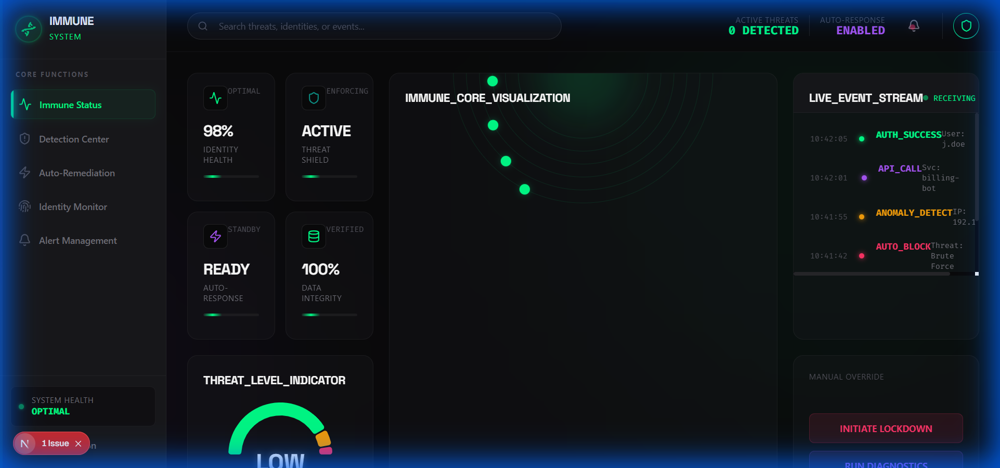
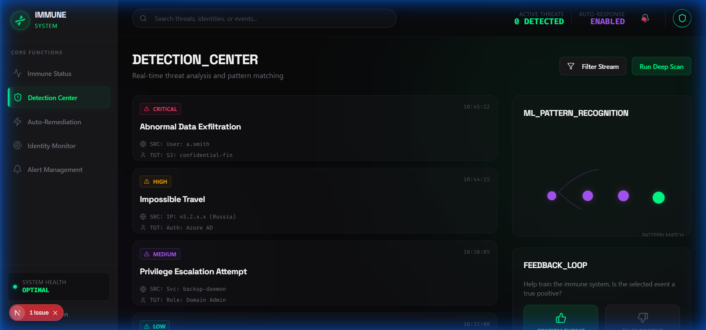
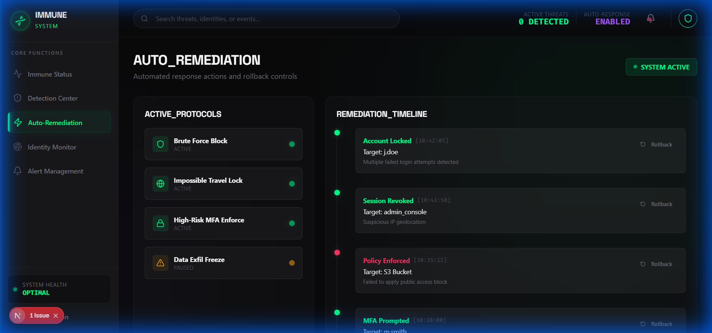
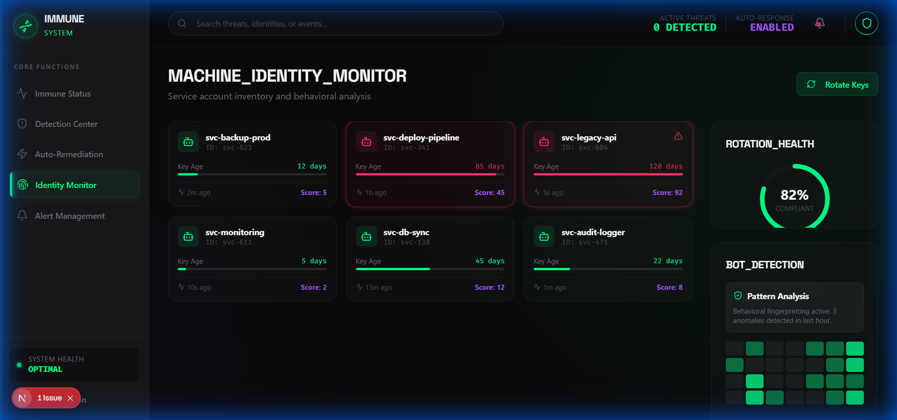
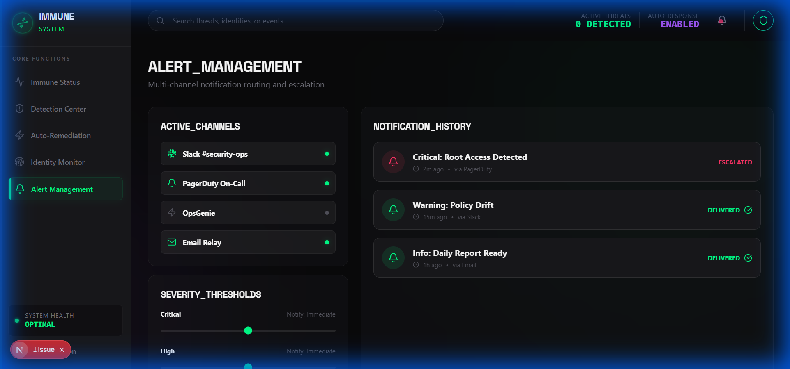

# IAM Immune System - Frontend Walkthrough

Real-time security orchestration platform with a biological immune system metaphor, featuring a Bio-Organic Dark Stealth aesthetic.

## Technology Stack

- **Framework**: Next.js 16 with App Router
- **Styling**: Tailwind CSS v4 with custom theme
- **Animations**: Framer Motion for organic effects
- **Charts**: Recharts for data visualization
- **Icons**: Lucide React
- **Fonts**: Space Grotesk (headlines) + Inter (body) + Fira Code (data)

## Design System

### Color Palette
| Color | Hex | Usage |
|-------|-----|-------|
| Void Black | #09090B | Primary background |
| Obsidian | #18181B | Elevated surfaces |
| Bioluminescent Green | #00FF88 | Life, detection, healthy |
| Neural Purple | #A855F7 | ML/AI activity |
| Deep Teal | #0D9488 | Intelligence, depth |
| Bio-Red | #FF3366 | Threats, infections |
| Amber Pulse | #F59E0B | Warnings |
| Soft Green | #22C55E | Normal operation |
| Ghost White | #FAFAFA | Primary text |
| Steel Gray | #71717A | Secondary text |

### Visual Effects
- Heartbeat pulse animations on health indicators
- Neural network connection animations
- Organic glow effects (shadow-glow-bio, shadow-glow-neural)
- DNA helix-inspired loading states
- Particle streams between connected elements

## Custom Components

### Bio-Organic UI Components
- **BioCard**: Glass panels with organic glow borders
- **NeuralButton**: Buttons with synaptic pulse effects
- **PulseIndicator**: Real-time status with heartbeat animation
- **OrganismCore**: Animated central visualization

## Screens

### 1. Immune System Status (Dashboard)
- Central organism visualization with pulsing activity
- Vital signs metrics with heartbeat animations
- Active response indicators
- Threat level bio-gauge
- DNA helix event stream

### 2. Detection Center
- Threat event cards with severity indicators
- Neural network ML confidence visualization
- Pattern matching panel
- False positive feedback controls
- Anomaly score distribution

### 3. Auto-Remediation Console
- Action timeline with glowing nodes
- Rollback controls for automated actions
- If-then remediation rule cards
- Before/after impact assessment
- Manual approval checkpoints

### 4. Machine Identity Monitor
- Service account inventory cards
- Key rotation health bars (green to red gradient)
- API call pattern heatmaps
- Anomaly detection flags
- Bot vs human analysis panel

### 5. Alert Management
- Multi-channel status (Slack/Teams/Email)
- Alert routing flow diagram
- Severity threshold sliders
- Notification history timeline
- On-call integration status

## Screenshots

### Immune System Dashboard


### Detection Center


### Auto-Remediation Console


### Machine Identity Monitor


### Alert Management


## Running the Frontend

```bash
cd frontend
npm install
npm run dev
```

Visit http://localhost:3000

## Build

```bash
npm run build
```

## Key Technical Features

- **Tailwind v4**: CSS-first configuration with custom glow utilities
- **Framer Motion**: Organic animations simulating biological systems
- **Real-time Updates**: Smooth fade animations for live data
- **Responsive Design**: Adapts to all screen sizes

## Next Steps

- Integrate with EventBridge/Pub-Sub for real-time events
- Connect ML models for anomaly detection
- Implement actual auto-remediation workflows
- Add WebSocket support for live threat feeds
